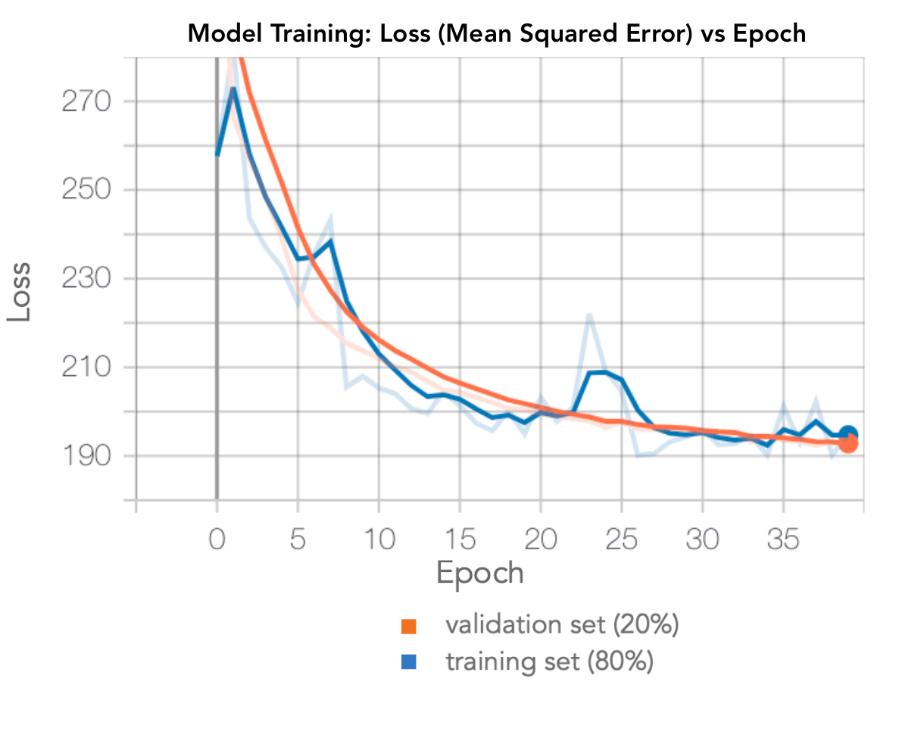
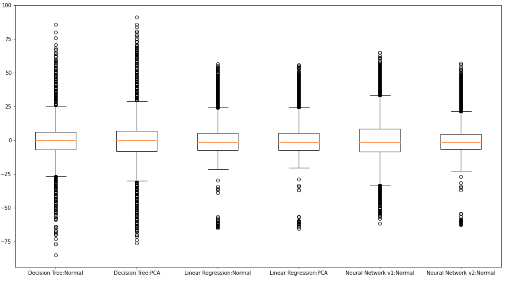

# CS 4641 Project
Spotify is a media streaming platform that allows users to listen to upwards of 60 million songs. Spotify provides users with information about songs like music genre, song length, artist, album. By tallying the number of individual streams of a song (or any piece of media), Spotify also provides users (and artists) with a metric of how popular a song is. Behind the scenes, Spotify keeps track of features of songs including modality, “danceability, energy, and tone. We have reason to believe that these features created by spotify are capable of predicting some level of popularity amongst other song titles with similar features. We have examples of analysing these sorts of features to support us [1,4]. 

# Problem Statement
Spotify has been an ever improving platform for a while now and currently holds the top spot among audio streaming platforms. Many artists recognize the importance of such a platform and have been utilizing the platform even more to attract listeners and build fanbases. 
Given that Spotify measures a large variety of information about the songs on its platform, we intend to investigate how the relationships between these features, both front-facing and not, interweave to affect the popularity of music upon release by predicting the popularity of a song given certain features. These predictive capabilities would be useful for artists and labels looking to optimize their music outputs in an effective way [1]. Though some other sources exist that have intended to achieve a similar goal, we hope to use a combination of unsupervised and supervised learning to achieve a more optimal and accurate analysis.

# Data Collection
A single Kaggle dataset was used throughout the course of this project midpoint [5]. All steps taken to ensure the data set be properly cleaned and prepared for any machine learning algorithms were taken with respect to how they would assist in solving our problem. The first step taken was to read in our data set as a csv and ensure all data types were properly assigned to each feature. The initial data was described below:

Seeing as the label of choice(popularity), was pre-recorded in a range of 0-100, it was left as an integer though considerations were made as to turning it into a floating point probability. This was decided against as chosen algorithms were likely to be supervised regressions and having that range would be more presentable in some graphs. After assigning types, string metrics such as artist name were modified to remove extraneous characters(i.e., brackets, commas, etc). Numeric features with odd units were changed to simpler units(e.g., duration_ms was converted to duration_sec), and release dates were cleaned to just include the year. Once complete, feature importance received its first considerations with respect to the problem definition. Most data columns provided numeric data of hardly identifiable metrics provided by spotify’s API so those were left in the data as there was no reason to consider them useless with the exception of a release-date column which was deemed not very useful in its form therefore it was dropped. Columns of text such as id and song name were removed as they provided no real significance in predicting song popularity. The artist name column was removed as well however it was noted that this feature should be kept around as it could be used to generate more features via third-party APIs such as Chartmetric. With these columns removed, re-analysis of numeric columns took place and it was decided that data instances containing song durations of over 20 minutes(1200sec) should be removed as they will skew the data unfavorably(based on some histogram analysis and group discussion). In addition, the categorical feature representing the key of each song was converted to be one-hot encoded as the song keys were independent in their effect on individual songs and how they affect listening experience. After making these higher level decisions, lower level analysis in the form of histograms, correlation matrices and scatter plots occurred. It was noticed that a numerical feature “instrumentalness” had a large skew towards 0 represented in the data set which gave cause to believe this value was not recorded effectively in the initial acquisition and for that reason should be dropped. 

Analysis of all other numerical features were displayed in relation to popularity as seen below.

After this analysis, it was noticed that there was a similarly large presence of songs with 0 popularity which could be the result of skewed song selection by year or some other data input error but understandably this data is necessary for solving the defined problem therefore it was decided that any further analysis should be halted while this data was split into even sections as it would be in a training/testing data split. The thought process was that, if this data was sectioned evenly with regard to popularity and then analysed for correlations then model results would be more accurate when testing and hopefully equally as accurate when provided new data. In order to split this data evenly with respect to our label, a categorical feature was created using a quantile-based discretization function which created 4 bins of data with respect to popularity. After generating these bins, a stratified shuffle sampling was used to ensure even splits of data occurred with respect to each bin based on a test size ratio of 0.2. To verify this data was evenly split, we printed out the percentage of presence from each popularity bin in our training data and the total data which displayed results that were equal to the 3rd decimal place! 

After splitting this data, the test set was put aside and further analysis occurred on the training set. Through the use of pearson’s correlation matrix it was discovered that some features which did not have a strong correlation with popularity had a strong correlation with other features.

4 of these instances were analyzed and through the use of some experimental testing, 3 of these instances produced extra features with above 24% correlation to popularity which was very exciting to see. Most of the initially provided features lacked much description and any unit input therefore they are not easily justifiable as to the relationships discovered in them though they were added with the hope hidden trends would be revealed. This would conclude the data exploration and cleaning phase.

# Methods
The methods of data collection were quite simple. After downloading the dataset from Kaggle, we used Pandas to clean our data. Non-numeric values such as song ID and song name were removed by dropping the column, and the names of the artist were trimmed to remove the extraneous symbols that were included in the dataset using string splicing. The transition of the length of the song from milliseconds to seconds were achieved through mathematical operations on the entire column, and we then followed up by disregarding all songs that were longer than 20 minutes by dropping the row. The creation of one-hot encoded variables in order to account for the song’s key in its popularity was done by creating new rows that were set to either 0 or 1 based on the song’s key. After cleaning our data, we then displayed the Pearson Correlation Table for our data using Pandas’ corr method. 

After cleaning our data, we applied PCA (using the scikit implementation) to it to reduce its dimensionality. We made use of MLE (through the scikit function parameter) to determine an appropriate amount of dimensions from our original data. 

We made use of three different types of supervised learning: a decision tree, a linear regression model, and a neural network. The decision tree was made using the sklearn tree class DecisionTreeRegressor object, with the goal being to learn decision rules from data features, assuming there is a non-linear/complex relationship. The linear regression model was created using the sklearn linear_model LinearRegression class, with the goal being to map a linear relationship between observed targets and predicted points. The neural net was made using Keras with an Adam (adaptive moment estimation) optimizer rather than an SGD procedure, a ReLU activation function on the first three layers, and a linear activation function on the last layer. For all of these model types, we ran the data on the PCA data as well as on the original data as a gauge of PCA’s efficacy in hopes of yielding better results.

# Results
The Linear Regression model was able to predict popularity with a RMSE score of 10.1 without PCA and 10.2 with PCA. This means that running PCA on our data is actually causing us to do worse. Perhaps the scikit-learn implementation of PCA using MLE to decide component size is not optimal for our purposes in predicting our popularity score.

These histograms show the distribution of predicted scores on top of the distribution of actual scores. As shown, the linear model has difficulty predicting scores over 65 and fails to accurately predict many of the songs with a score of zero. It could be the case that the test data fails to capture the trends in the training data, specifically the large number of songs having popularity of zero (more than 8% of the test data) as well as a lack of context in what specific features lead to a zero score in popularity. The PCA analysis slightly alleviates this concern by considering the features for which there is maximum variance, but this is not enough to overcome the differences between the test/train data. Another hypothesis is as follows: linear regression attempts to minimize the vertical distance between points and the given best-fit line through RMSE; in the above case where the data has a right “skew”, the line attempts to minimize error among non-zero points and in doing so, pulls the line above most data points and effectively overestimate the popularity over the distribution as above. The regression model did not predict values over 65 overall. Such a result can be explained following the behavior of the best-fit line as above; the test/training data does not have many high popularity score songs and with the best-fit line being pulled down from the prevalence of popularity zero data, higher popularity points are underestimated.

The Decision Tree model performed well, with an RMSE of 12.7 without PCA and 14.4 with PCA.This means that, yet again, while the RMSE was low, reducing the dimensionality of our data yielded seemingly poorer results and generated more error.

The histograms for predicted and actual scores look incredibly similar for the decision tree models. What this might mean is that the introduction of PCA on our variables actually decreased the accuracy of the decision tree model. The reason that this might be happening is that some of the principal components which were reduced which had less variance played a slight role in terms of determining the potential popularity of the song. This would explain why the RMSE of the PCA reduced data had a slightly higher RMSE than the non-PCA reduced data. 

At first, the Neural Network model did not clearly outperform the other models, with a RMSE score of 13.7.

As you can see the neural network approach had a similar problem to the regression approach, where the model had trouble predicting scores of over 65. Seemingly, there was clearly more work to do here, because the neural network was underperforming even basic linear regression. There were many reasons why we thought we might be seeing an inability to properly predict scores. The first concern that is often an issue with neural networks is overfitting, but if we look at the model’s training (orange) and validation (blue) loss we can see that it doesn’t appear to be overfitting.

If the model was overfitting we would likely see a large difference in performance between the training and validation sets (the model would have much lower loss on the training set than the validation set). In order to figure out why our model was under performing, we decided to run a large number of experiments with different hyperparameters, varying model size, depth, optimization, learning rate, and other parameters. After running many of these experiments, training various models in the range of 40-100 epochs, we found none of the models outperformed the 13.7 mse score achieved by our initial model. With more investigation, we found that that model didn’t appear to be plateauing quite yet so we decided to train it more to see if it would improve. With a new round of training (100 epochs) we found that the MSE was dramatically reduced from the 190 range to the 100 range: 

Training an additional 200 epochs in this range shows our accuracy on the validation remaining in this 100 range, so we concluded training at the 171th step in this training cycle (311th step overall).

We believe at this stage the neural network has achieved close to its maximum performance for these hyperparameters. The RMSE score for this model is 9.801. This score shows that, as we suspected, the neural network model was able to outperform all of the other approaches given the right training conditions. 

The histograms of the two neural nets look quite similar. The most significant difference is for the predictions between the 20-65 range as the new model has less prediction error in the middling data points overall and has fewer outliers among these predictions as can be seen by the smaller “twin peaks” at the 37 and 52 score mark in the new model as opposed to the “single” peak for the old model at a score of 38. It is interesting to note that the first neural net predicted scores above 65, albeit quite poorly, but the second neural net never predicted a popularity score greater than 65.

One way to compare each model is to plot the residuals on the same axis. Here we have a box plot showing the residuals (actual value - predicted value) for each model we have trained.

As you can see, the decision tree models have the most outliers, with some cores being predicted to be 75+ higher or lower than the actual scores. This shows that although the distribution of predicted scores looked very good for the decision tree models, many data points have been mapped to the complete wrong side of the distribution. 

Linear regression, both the normal and PCA, has a tighter bound among its outliers as expected given the line of best fit will still try to minimize distance with respect to these popularity zero data points. Despite such an attempt, the popularity zero points are heavily underestimated as evidenced by the section of outliers in the -55 to -70 range. Similarly, the high popularity songs are not predicted well either and we have a range of outliers from 25 to 55. Songs with middling popularity are mapped well as linear regression has a small interquartile range and smallest whiskers.

The first version of the neural network had somewhat similar results to the decision trees in the whisker length, yet being ±10 points more in popularity score than both the decision tree and the linear regression and indicating that the predictions had greater error throughout the dataset. The outliers indicate that the cases where the model underestimated by a large margin were less than the other two models with the min outlier reaching -70. For overestimating in the context of outliers, the neural network had a similar range as the linear regression. The neural net had “safe” predictions overall, but the average error among all data points made it the worst model among the three.

The second version of the neural network alleviated some of the mentioned issues given that the new model had the smallest interquartile range, indicating that this was the best model for predicting the middle 50% of the data. However, the model followed a similar trend as the linear regression for the outliers with respect to underestimating and overestimating. 

As an additional metric we wanted to see what percent of test data points the model could accurately predict within 10. We made a metric called “rounded accuracy” to give us a feel of how often our predictions were within ten of our actual values by rounding each point to the nearest 10 and then computing accuracy. 

The table above shows the RMSE and Rounded Accuracy scores of all the method supervised learning methods we have implemented at this point. As we can see the second version of the Neural Net performed the best in terms of producing the least amount of error while the Decision Tree sans PCA had most of its values within 10 “popularity points” of the true value, though the Neural Net v2 was pretty comparable as well.

# Discussion
In regards to our use of PCA, we think perhaps conducting further testing on what the best number of features to take may be warranted due to the results of our algorithms with PCA actually performing worse than without. This testing would involve looping through all the possible number of components to find the number of components that retain a specifically set variance. Furthermore, we also can look at analyzing the correlation between features in preprocessing to determine a reasonable number as another possibility of improving PCA’s effect on our data.

For our next phase, we can introduce cross-validation. In this phase, we randomly generated what our training and testing dataset would be, but the datasets stayed constant throughout the different models and trials. By implementing cross validation, we would reduce the probability that random chance influenced the accuracy of our models by creating multiple instances of testing data. We would also be able to test on all instances of our song’s with our model which would stabilize our accuracy rating for each model.

The main goal for the next few weeks will be to analyze the results in order to figure out why each model is performing the way it is. For example, the neural network has a higher RMSE value than linear regression, which means that there is definitely room to improve it. We can try to tune the hyperparameters of the model by training a few more baselines with different structures. We can also experiment with different loss, activation, and optimization functions to see how the data responds to other approaches. For the decision trees we can analyze why they are able to correctly predict popularity values for so many of the data points, but have so many outliers where the predicted score is over 70 points off. If it is possible to figure out the common characteristics of data points that aren’t able to be predicted well by the decision trees, we could figure out whether we can preprocess the data or change the model in order to improve accuracy on those data points.  

# References
[1] http://cs229.stanford.edu/proj2015/140_report.pdf 

[2] https://github.com/MattD82/Predicting-Spotify-Song-Popularity

[3] https://dl.acm.org/doi/pdf/10.1145/3068335 

[4] https://arxiv.org/pdf/1908.08609.pdf 

[5] https://www.kaggle.com/yamaerenay/spotify-dataset-19212020-160k-tracks

